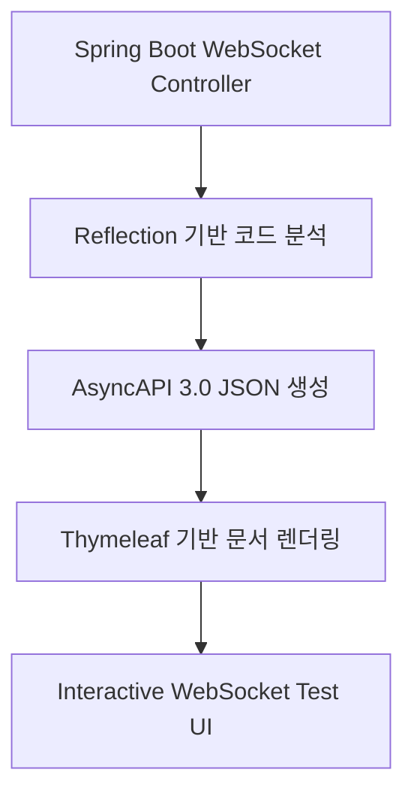

# 🔌 WebSocket Docs Generator

**Spring Boot WebSocket API를 위한 자동 AsyncAPI 문서 생성 라이브러리**

[](https://search.maven.org/artifact/io.github.20hyeonsulee/websocket-docs-generator)
[](https://opensource.org/licenses/MIT)
[](https://openjdk.java.net/)
[](https://github.com/20HyeonsuLee/websocket-docs-generator)

## 📋 개요

Spring Boot 기반의 WebSocket/STOMP 애플리케이션을 위한 **AsyncAPI 3.0 문서를 자동으로 생성**하는 라이브러리입니다. 
간단한 애노테이션 추가만으로 전문적인 WebSocket API 문서와 대화형 테스트 인터페이스를 제공합니다.

### ✨ 주요 특징

- 🚀 **완전 자동화**: 기존 코드에 간단한 애노테이션만 추가
- 📄 **AsyncAPI 3.0 지원**: 표준 WebSocket API 명세 생성
- 🎨 **인터랙티브 UI**: 실시간 WebSocket 테스트 및 디버깅
- 🔧 **Spring Boot 통합**: Auto-Configuration으로 즉시 사용 가능
- 🎯 **JSON Schema 자동 생성**: DTO 클래스에서 스키마 자동 추출
- 🛠️ **운영 환경 지원**: 프로덕션 환경에서 문서 비활성화 가능
- 📋 **제네릭 타입 지원**: `List<User>`, `Optional<String>` 등 1-depth 제네릭 타입 완벽 지원
- 🎭 **스마트 타입 처리**: 복잡한 패키지명을 간단한 클래스명으로 자동 변환

## 🏗️ 아키텍처 & 컨셉

### 핵심 설계 철학

이 프로젝트는 **"개발자가 이미 작성한 코드에서 문서를 추출한다"** 는 철학을 기반으로 설계되었습니다.



### 작동 원리

1. **코드 스캔**: `@MessageMapping`, `@MessageResponse` 등의 애노테이션이 붙은 메소드들을 스캔
2. **스키마 생성**: DTO 클래스들을 분석하여 JSON Schema 자동 생성
3. **AsyncAPI 생성**: AsyncAPI 3.0 표준에 따라 WebSocket API 명세 생성  
4. **문서 렌더링**: Thymeleaf 템플릿으로 인터랙티브한 HTML 문서 생성

## 🔧 프로젝트 구조

```
src/main/java/generator/
├── annotaions/                    # 커스텀 애노테이션 정의
│   ├── Operation.java             # 오퍼레이션 메타데이터 (summary, description)
│   ├── MessageResponse.java       # 메시지 응답 정의 (경로, 반환 타입)
│   ├── JsonSchemaEnumType.java    # JSON Schema Enum 타입 지원
├── config/                        # Spring Boot 설정
│   ├── DocsAutoConfiguration.java # Auto Configuration 클래스
│   └── DocsProperties.java        # 설정 프로퍼티
├── controller/                    # Web Controller
│   └── DocsController.java        # 문서 엔드포인트 (/docs)
└── AsyncApiGenerator.java         # 핵심 문서 생성 로직
```

### 핵심 클래스 상세

#### `AsyncApiGenerator.java`
- **역할**: AsyncAPI 3.0 명세 생성의 핵심 엔진
- **기능**:
  - Reflection을 사용하여 `@MessageMapping` 메소드 스캔
  - DTO 클래스에서 JSON Schema 자동 생성
  - WebSocket 채널 및 오퍼레이션 정의 생성
  - 최종 AsyncAPI YAML 출력

#### Custom Annotations
- `@Operation`: 메소드에 summary, description 추가
- `@MessageResponse`: STOMP 응답 메시지 정의 (path, returnType)
- `@JsonSchemaEnumType`: Enum 필드의 JSON Schema 생성 지원

## 📦 설치 & 설정

### 1. 의존성 추가

**Gradle (Kotlin DSL)**
```kotlin
dependencies {
    implementation("io.github.20hyeonsulee:websocket-docs-generator:1.0.7")
}
```

**Maven**
```xml
<dependency>
    <groupId>io.github.20hyeonsulee</groupId>
    <artifactId>websocket-docs-generator</artifactId>
    <version>1.0.7</version>
</dependency>
```

### 2. 설정 파일 구성

**application.yml**
```yaml
websocket:
  docs:
    # 문서 생성 활성화 여부 (기본값: true)
    enabled: true
    
    # 스캔할 베이스 패키지 (필수)
    base-package: "com.example.websocket"
    
    # WebSocket 경로 설정
    app-path: "/app"        # 클라이언트 → 서버 메시지 경로
    topic-path: "/topic"    # 서버 → 클라이언트 메시지 경로
    
    # WebSocket 서버 URL (테스트 페이지 기본값)
    server-url: "http://localhost:8080/ws"
    
    # 문서 정보
    info:
      title: "WebSocket API 명세서"
      version: "1.0.0"
      description: "실시간 WebSocket 통신 API 문서"
```

### 3. 운영 환경 설정

프로덕션 환경에서 문서를 비활성화하려면:

```yaml
# application-prod.yml
websocket:
  docs:
    enabled: false  # 문서 생성 비활성화
```

## 🎯 사용법

### 1. 기본 WebSocket Controller 작성

```java
@Controller
public class ChatController {
    
    @Operation(
        summary = "채팅방 입장", 
        description = "사용자가 특정 채팅방에 입장합니다"
    )
    @MessageMapping("/chat/join/{roomId}")
    @MessageResponse(path = "/room/{roomId}", returnType = UserJoinedEvent.class)
    public void joinRoom(@DestinationVariable String roomId, JoinRequest request) {
        // 채팅방 입장 로직
        UserJoinedEvent event = new UserJoinedEvent(request.getUserName(), roomId);
        messagingTemplate.convertAndSend("/topic/room/" + roomId, event);
    }
    
    @Operation(
        summary = "메시지 전송",
        description = "채팅방에 메시지를 전송합니다"
    )  
    @MessageMapping("/chat/message/{roomId}")
    @MessageResponse(path = "/room/{roomId}", returnType = ChatMessage.class)
    public void sendMessage(@DestinationVariable String roomId, ChatMessageRequest request) {
        ChatMessage message = new ChatMessage(request.getContent(), request.getSender(), roomId);
        messagingTemplate.convertAndSend("/topic/room/" + roomId, message);
    }
    
    // 🆕 제네릭 타입 지원 예시
    @Operation(
        summary = "사용자 목록 조회",
        description = "채팅방의 모든 사용자 목록을 반환합니다"
    )
    @MessageMapping("/chat/users/{roomId}")
    @MessageResponse(path = "/room/{roomId}/users", returnType = List.class, genericType = User.class)
    public void getUserList(@DestinationVariable String roomId) {
        List<User> users = chatService.getUsersInRoom(roomId);
        messagingTemplate.convertAndSend("/topic/room/" + roomId + "/users", users);
    }
}
```

### 2. DTO 클래스 정의

```java
// 요청 DTO
public class JoinRequest {
    private String userName;
    private String userType;
    // getters, setters...
}

// 응답 DTO  
public class UserJoinedEvent {
    private String userName;
    private String roomId;
    private LocalDateTime joinedAt;
    // getters, setters...
}

// Enum 처리가 필요한 경우
public class ChatMessageRequest {
    private String content;
    private String sender;
    
    @JsonSchemaEnumType(enumType = MessageType.class)
    private String messageType;
    // getters, setters...
}

enum MessageType {
    TEXT, IMAGE, FILE, EMOJI
}
```

### 3. 문서 접근

애플리케이션 실행 후 `http://localhost:8080/docs`에 접속하면 자동 생성된 WebSocket API 문서를 확인할 수 있습니다.

### 4. 🆕 제네릭 타입 사용 예시

**1-depth 제네릭 타입을 완벽 지원합니다:**

```java
// List 타입
@MessageResponse(path = "/users", returnType = List.class, genericType = User.class)
// → 문서에서 "List<User>"로 표시, 배열 스키마 자동 생성

// Optional 타입  
@MessageResponse(path = "/result", returnType = Optional.class, genericType = String.class)
// → 문서에서 "Optional<String>"로 표시

// Map 타입
@MessageResponse(path = "/data", returnType = Map.class, genericType = Object.class)
// → 문서에서 "Map<Object>"로 표시

// 제네릭 없는 일반 타입
@MessageResponse(path = "/user", returnType = User.class)
// → 문서에서 "User"로 표시
```

**생성되는 문서 형태:**
- **Messages**: `List<User>`, `Optional<String>` 등으로 직관적 표시
- **Example**: `[{User 객체 예시}]` 형태의 배열 예시 자동 생성
- **Schema**: List 자체가 아닌 제네릭 타입(`User`)의 스키마만 생성

## 🎨 생성되는 문서 기능

### 📄 AsyncAPI 문서
- **Operations**: SEND/RECEIVE 오퍼레이션 자동 분류
- **Channels**: WebSocket 채널별 메시지 스키마
- **Components**: DTO 기반 JSON Schema 자동 생성
- **Interactive UI**: 접기/펼치기 가능한 직관적인 인터페이스

### 🧪 실시간 테스트 도구
- **WebSocket 연결**: SockJS/STOMP 연결 테스트
- **메시지 전송**: JSON 페이로드로 실시간 메시지 전송
- **구독 관리**: Topic 구독/해제 및 실시간 메시지 수신
- **변수 치환**: 경로 변수 (`{roomId}`, `{userId}`) 자동 치환 UI
- **로그 모니터링**: 연결 상태 및 송수신 메시지 실시간 로깅

## 🔧 고급 설정

### 1. Enum 타입 스키마 생성

```java
public class OrderRequest {
    @JsonSchemaEnumType(enumType = OrderStatus.class)
    private String status;  // JSON Schema에서 enum으로 표시됨
}
```

### 2. 복잡한 중첩 객체 지원

```java  
public class GameState {
    private String gameId;
    private List<Player> players;      // 배열 스키마 자동 생성
    private GameSettings settings;     // 중첩 객체 스키마 자동 생성
    private Map<String, Object> metadata;  // Map 타입도 지원
}
```

### 3. 🆕 제네릭 타입 고급 활용

```java
// 복잡한 제네릭 파라미터 처리
@MessageMapping("/game/players/{gameId}")
public void updatePlayers(@DestinationVariable String gameId, List<PlayerUpdate> updates) {
    // List<PlayerUpdate> 자동 인식 및 스키마 생성
}

// 제네릭 응답 타입
@MessageResponse(path = "/game/{gameId}/results", returnType = Optional.class, genericType = GameResult.class)
public void sendGameResult(@DestinationVariable String gameId) {
    // Optional<GameResult> 타입으로 문서 생성
}
```

### 4. 스마트 타입 이름 처리

라이브러리는 자동으로 복잡한 패키지명을 처리합니다:

- **Java 코드**: `com.example.chat.dto.ChatMessageRequest`
- **문서 표시**: `ChatMessageRequest`
- **제네릭**: `java.util.List<com.example.User>` → `List<User>`

### 5. JSON 호환성 보장

내부적으로 제네릭 타입을 JSON 호환 형태로 처리:
- **내부 키**: `List_User` (JSON 파싱용)
- **사용자 표시**: `List<User>` (직관적 표시)

## 🚀 개발 환경 설정

### 요구사항
- **Java**: 17+
- **Spring Boot**: 3.0+
- **Build Tool**: Gradle 8.0+ 또는 Maven 3.8+

### 로컬 개발용 빌드

```bash
git clone https://github.com/20HyeonsuLee/websocket-docs-generator.git
cd websocket-docs-generator

# Gradle을 사용하는 경우
./gradlew build

# 테스트 실행
./gradlew test

# 로컬 Maven 저장소에 설치
./gradlew publishToMavenLocal
```

## 🎯 사용 사례

### 실시간 채팅 애플리케이션
```yaml
# 생성되는 AsyncAPI 예시
operations:
  '/chat/join/{roomId}':
    action: send
    summary: 채팅방 입장
    channel: '/app/chat/join/{roomId}'
    reply:
      channel: '/topic/room/{roomId}'
      messages: [UserJoinedEvent]
      
  '/chat/users/{roomId}':  # 🆕 제네릭 타입 예시
    action: send
    summary: 사용자 목록 조회
    channel: '/app/chat/users/{roomId}'
    reply:
      channel: '/topic/room/{roomId}/users'
      messages: [List_User]  # 내부적으로 List_User로 처리
```

### 실시간 게임 상태 동기화
```yaml  
operations:
  '/game/move/{gameId}':
    action: send
    channel: '/app/game/move/{gameId}'
    messages: [PlayerMoveRequest]
    reply:
      channel: '/topic/game/{gameId}/state'  
      messages: [GameStateUpdate]
      
  '/game/players/{gameId}':  # 🆕 List 파라미터 지원
    action: send
    channel: '/app/game/players/{gameId}'
    messages: [List_PlayerUpdate]
```

### 문서에서의 표시
실제 문서에서는 사용자 친화적으로 표시됩니다:
- **Payload Type**: `List<User>` (화면 표시)
- **Example**: `[{"id": 1, "name": "사용자1"}, {"id": 2, "name": "사용자2"}]`
- **Schema Tree**: Array > items > User 구조

## 🔄 버전 히스토리

- **1.0.7**: 🆕 최신 버전
  - **제네릭 타입 완벽 지원**: `List<User>`, `Optional<String>` 등 1-depth 제네릭 타입
  - **스마트 타입 표시**: 패키지명 자동 제거 및 직관적 타입명 표시
  - **배열 스키마 개선**: List 반환 타입의 올바른 스키마 생성 및 예시 표시
  - **JSON 호환성**: 내부적으로 `<>` → `_` 변환하여 JSON 파싱 오류 해결
  - **UI 개선**: `List_User` → `List<User>` 형태로 사용자 친화적 표시

- **1.0.6**: 운영 환경 지원 버전
  - 운영 환경 문서 비활성화 기능 (`enabled: false`)
  - JSON Schema enum 타입 개선
  - 인터랙티브 테스트 UI 성능 개선

- **1.0.2**: JSON Schema 생성 안정성 개선
- **1.0.0**: 초기 릴리스

## 🤝 기여하기

1. Fork the Project
2. Create your Feature Branch (`git checkout -b feature/AmazingFeature`)
3. Commit your Changes (`git commit -m 'Add some AmazingFeature'`)
4. Push to the Branch (`git push origin feature/AmazingFeature`)
5. Open a Pull Request

## 📝 라이선스

이 프로젝트는 MIT 라이선스 하에 배포됩니다. 자세한 내용은 [LICENSE](LICENSE) 파일을 참조하세요.

## 👨‍💻 개발자

**이현수 (Hyeonsu Lee)**
- GitHub: [@20HyeonsuLee](https://github.com/20HyeonsuLee)  
- 프로젝트 링크: [https://github.com/20HyeonsuLee/websocket-docs-generator](https://github.com/20HyeonsuLee/websocket-docs-generator)

---

**⭐ 이 프로젝트가 도움이 되었다면 Star를 눌러주세요!**
