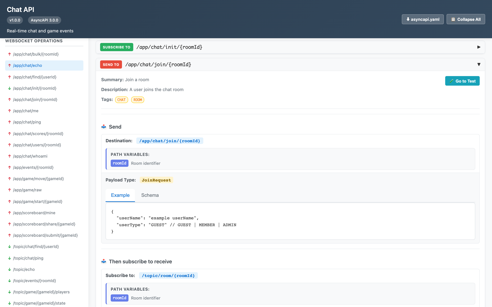
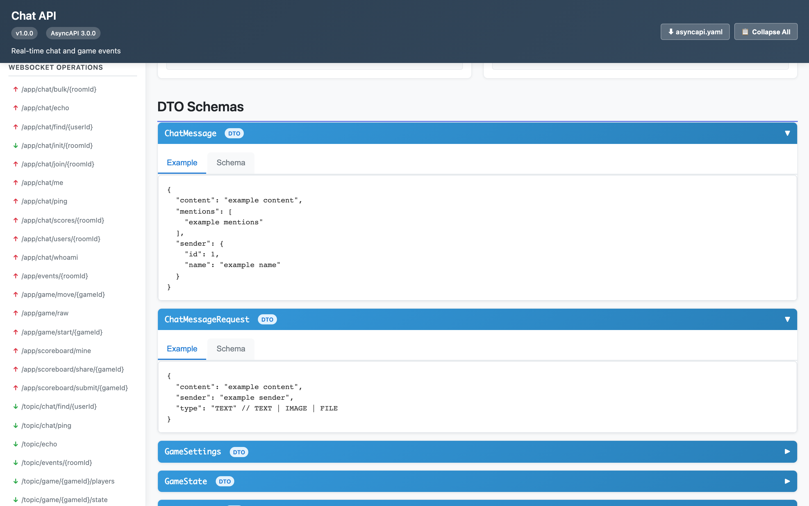
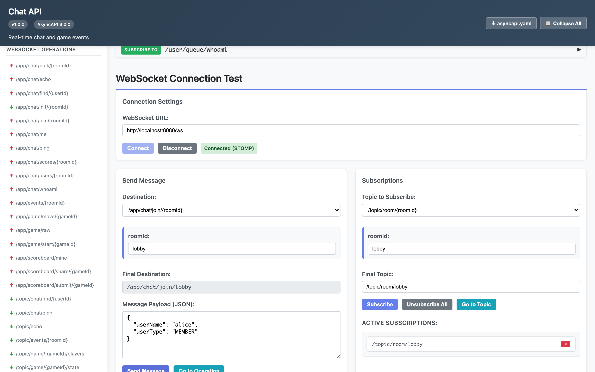

# WebSocket Docs Generator

**AsyncAPI 3.0 documentation and an interactive STOMP console for Spring Boot WebSocket applications — zero configuration.**

[](https://central.sonatype.com/artifact/io.github.20hyeonsulee/websocket-docs-generator)
[](LICENSE)
[](https://openjdk.java.net/)
[](https://github.com/20HyeonsuLee/websocket-docs-generator/actions/workflows/ci.yml)

Think *springdoc for STOMP*. Add one dependency and `/ws-docs` lists every `@MessageMapping` and `@SubscribeMapping`
handler in your application, the messages it receives, the messages it publishes, and the JSON schemas of both —
read from the Spring container, not from annotations you have to write. The page includes a STOMP client so you can
subscribe and send messages the same way you try requests in Swagger UI.





## Why

- **Nothing to configure.** Endpoints come from Spring's STOMP handler registry (`SimpAnnotationMethodMessageHandler`)
  and bean definitions, the same way springdoc reads `RequestMappingHandlerMapping`. Application and user destination
  prefixes are taken from your `@EnableWebSocketMessageBroker` configuration.
- **Publications are inferred.** Return types, `@SendTo`, `@SendToUser`, class-level `@SendTo`, and the
  `@SubscribeMapping` direct reply are documented exactly as Spring routes them. Annotate only what cannot be seen in
  code, such as `SimpMessagingTemplate.convertAndSend` calls.
- **Standard output.** A valid [AsyncAPI 3.0](https://www.asyncapi.com/) document is served as YAML and JSON for other
  tools. Operations use the server perspective the spec requires (`receive` = the server receives, `send` = the server
  sends); the UI shows the client's view (*send to* / *subscribe to*).
- **Interactive console.** Connect over SockJS/STOMP, subscribe to topics and send messages from the docs page, with
  example payloads generated from the schemas.
- **Accurate schemas.** `List<User>`, `Map<String, List<Score>>`, `Optional<User>`, arrays, enums, nested DTOs and
  `java.time` types are rendered correctly. Your application's Jackson `ObjectMapper` is used, so a global
  `SNAKE_CASE` naming strategy or `@JsonProperty` shows up in the document.
- **Nothing leaks into your project.** Spring, Jackson and SnakeYAML are `compileOnly`; the only transitive
  dependencies are the two [victools](https://github.com/victools/jsonschema-generator) schema modules. The UI assets
  are bundled, no CDN.
- **Off in production.** `websocket.docs.enabled=false` registers no beans at all.

## Installation

Requires Java 17+ and Spring Boot 3.2–3.5 with `spring-boot-starter-web` and `spring-boot-starter-websocket`.

**Gradle (Kotlin DSL)**
```kotlin
dependencies {
    implementation("io.github.20hyeonsulee:websocket-docs-generator:2.0.0")
}
```

**Maven**
```xml
<dependency>
    <groupId>io.github.20hyeonsulee</groupId>
    <artifactId>websocket-docs-generator</artifactId>
    <version>2.0.0</version>
</dependency>
```

Start the application and open `http://localhost:8080/ws-docs`.

## What gets documented without annotations

```java
@Controller
@MessageMapping("/chat")
public class ChatController {

    @MessageMapping("/join/{roomId}")
    @SendTo("/topic/room/{roomId}")
    public UserJoinedEvent join(@DestinationVariable String roomId, JoinRequest request) { ... }

    @MessageMapping("/whoami")
    @SendToUser
    public User whoami(Principal principal) { ... }

    @SubscribeMapping("/init/{roomId}")
    public List<ChatMessage> history(@DestinationVariable String roomId) { ... }
}
```

| Code | Document |
|---|---|
| `@MessageMapping("/join/{roomId}")` with class prefix and `/app` from the broker config | `receive` operation on channel `/app/chat/join/{roomId}`, `x-stomp-frame: SEND`, parameter `roomId` typed from the `@DestinationVariable` |
| `JoinRequest request` | request message; `@Payload` wins if present, `@DestinationVariable`, `@Header(s)`, `Principal`, `MessageHeaders`, `MessageHeaderAccessor` and security principals are skipped, `Message<T>` unwraps to `T` |
| return type + `@SendTo("/topic/room/{roomId}")` | `send` operation on `/topic/room/{roomId}` with `UserJoinedEvent`, linked as the `reply` of the receive operation |
| return type + `@SendToUser` (no value) | `send` operation on `/user/queue/whoami`, `x-stomp-scope: user` (`/user` + `/queue` + request path, as Spring does) |
| return type, no annotation | `send` operation on `{default-destination-prefix}` + request path, as Spring does |
| `@SendTo` + `@SendToUser` on the same method, or on the class | both honoured, with the same precedence as Spring |
| `@SubscribeMapping` with a return value | `receive` operation with `x-stomp-frame: SUBSCRIBE`; the value goes directly to the subscriber, so it appears only as the `reply`, not as a broker `send` |
| enum fields, `@JsonProperty(required = true)`, `@JsonPropertyOrder`, `@JsonIgnore`, `@JsonNaming`, the `ObjectMapper` naming strategy | JSON Schema `enum`, `required`, property order, exclusions, property names |

## Annotations

Three annotations in `io.github.hyeonsulee.wsdocs.api` add what cannot be inferred.

### `@WsOperation` — describe a handler

```java
@MessageMapping("/join/{roomId}")
@SendTo("/topic/room/{roomId}")
@WsOperation(
        summary = "Join a room",
        description = "Announces the new member to everyone in the room.",
        tags = {"chat", "room"},
        publishes = @WsPublication(destination = "/topic/room/{roomId}", payload = UserJoinedEvent.class,
                summary = "Member joined"))
public UserJoinedEvent join(@DestinationVariable String roomId, JoinRequest request) { ... }
```

`summary`, `description` and `tags` describe the receive operation. `publishes` lists messages the handler sends.
A publication with the same destination and payload as the inferred reply only adds text to it; others are added as
further messages the handler sends.

### `@WsPublication` — declare a message the server sends

Use it on any Spring bean method, repeated as often as needed, for messages sent through `SimpMessagingTemplate`,
schedulers or event listeners.

```java
@Service
public class GameEventPublisher {

    @WsPublication(destination = "/topic/game/{gameId}/state", payload = GameState.class,
            summary = "Game state changed", tags = "game")
    @WsPublication(destination = "/topic/game/{gameId}/players", payload = Player[].class)
    public void broadcast(String gameId, GameState state) {
        template.convertAndSend("/topic/game/" + gameId + "/state", state);
        template.convertAndSend("/topic/game/" + gameId + "/players", state.players());
    }
}
```

`destination` is the absolute STOMP destination, exactly the string passed to `convertAndSend`. `payload` is a
class; use an array type such as `User[].class` for lists (annotations cannot express generics — for `Map` or
deeper generics let the return type be inferred instead). Publications to the same destination from several methods
are merged into one `send` operation listing every payload. Destinations under the user prefix (`/user` by default)
are marked `x-stomp-scope: user`.

### `@WsHidden` — exclude from the document

On a class it hides every handler and publication in it; on a method only that method.

```java
@WsHidden
@MessageMapping("/admin/reset/{roomId}")
public void reset(@DestinationVariable String roomId) { ... }
```

## Configuration

Everything is optional.

```yaml
websocket:
  docs:
    enabled: true                        # false registers no beans at all
    path: /ws-docs                       # docs page; /asyncapi.yaml and /asyncapi.json live under it
    default-destination-prefix: /topic   # where a bare return value goes (Spring's default)
    server-url: http://localhost:8080/ws # SockJS endpoint pre-filled in the console
    info:
      title: Chat WebSocket API
      version: 1.0.0
      description: Real-time chat API
```

| Endpoint | Content |
|---|---|
| `GET /ws-docs` | documentation page with the STOMP console |
| `GET /ws-docs/asyncapi.yaml` | AsyncAPI 3.0 document, YAML |
| `GET /ws-docs/asyncapi.json` | AsyncAPI 3.0 document, JSON |

### Spring Security

Allow the docs path, or disable the docs in production:

```java
http.authorizeHttpRequests(auth -> auth
        .requestMatchers("/ws-docs", "/ws-docs/**").permitAll()
        .anyRequest().authenticated());
```

```yaml
# application-prod.yml
websocket:
  docs:
    enabled: false
```

### Replacing beans

`EndpointScanner`, `AsyncApiGenerator` and `WsDocsController` are registered with `@ConditionalOnMissingBean`
(bean names `wsDocsEndpointScanner`, `wsDocsAsyncApiGenerator`, `wsDocsController`); define a bean of the same type
to replace one. The document is generated on first request and cached; `AsyncApiGenerator.refresh()` clears the
cache. Types under `io.github.hyeonsulee.wsdocs.internal` are not part of the public API and may change in any
release.

## Document format

The output follows AsyncAPI 3.0 and validates with the official parser. STOMP specifics that the spec has no field
for are extensions:

| Extension | Where | Values |
|---|---|---|
| `x-stomp-frame` | `receive` operations | `SEND` for `@MessageMapping`, `SUBSCRIBE` for `@SubscribeMapping` |
| `x-stomp-scope` | `send` operations | `broadcast`, or `user` for destinations under the user prefix |
| `x-schema` | channel parameters | JSON Schema of the `@DestinationVariable` type (enums use the standard `enum` field instead) |

Message keys are derived from the Java type (`User`, `List_User`, `UserArray`); `title` carries the readable form
(`List<User>`). Containers are rendered structurally and only DTOs become `components/schemas` entries.

## Limitations

- Only the first application destination prefix is used when several are configured.
- `@MessageExceptionHandler` methods are not documented.
- GraalVM native image: the library registers hints for its own annotations and resources, but the DTOs the schema
  generator inspects must be registered for reflection by the application.
- Spring Boot 4 (Jackson 3) is not supported by this line; a separate line based on victools 5 is planned.

## Migrating from 1.0.x

2.0.0 is a rewrite. The `generator.annotaions.*` annotations and the `base-package`, `app-path` and `topic-path`
properties are gone.

| 1.0.x | 2.0.0 |
|---|---|
| `@Operation(summary, description)` | `@WsOperation(summary, description, tags)` |
| `@MessageResponse(path = "/room/{id}", returnType = X.class)` | `@WsPublication(destination = "/topic/room/{id}", payload = X.class)` — absolute destination |
| `@MessageResponse(returnType = List.class, genericType = User.class)` | `@WsPublication(payload = User[].class)` |
| `@JsonSchemaEnumType` | not needed; declare the field with the enum type |
| docs at `/docs` | `/ws-docs`, or set `websocket.docs.path: /docs` |
| `websocket.docs.base-package`, `app-path` | removed; read from the Spring container |
| `websocket.docs.topic-path` | `websocket.docs.default-destination-prefix` |

Behavioural changes: every `@MessageMapping` is documented even without a publication; publications are inferred
from return values and `@SendTo`/`@SendToUser`; `action` follows the AsyncAPI 3.0 server perspective; channel and
operation keys are full addresses; path variables become channel parameters; container types are no longer
registered as schemas.

## Development

```bash
./gradlew build                                 # compile, test, jar
./gradlew test -Dwsdocs.updateSnapshot=true     # refresh src/test/resources/expected/asyncapi.yaml
./gradlew runTestApp                            # boot the fixture app, then open http://localhost:8080/ws-docs
./gradlew build -PspringBootVersion=3.2.12      # build against another Boot line (CI runs 3.2–3.5)
./gradlew publishToMavenLocal
```

Tests scan the fixture controllers under `src/test/java/.../fixture`, compare the generated YAML with a snapshot and
cover inference rules, generics, destination parameters, hidden endpoints, auto-configuration conditions and the
HTTP endpoints.

### Releasing

Push a tag like `v2.0.0`; GitHub Actions builds, tests and publishes to Maven Central. The tag must match `version`
in `build.gradle.kts`. Required repository secrets: `MAVEN_CENTRAL_USERNAME`, `MAVEN_CENTRAL_PASSWORD`,
`SIGNING_KEY` (ASCII-armored private key), `SIGNING_KEY_ID`, `SIGNING_PASSWORD`. For local publishing keep credentials
in `~/.gradle/gradle.properties`; the project's `gradle.properties` is git-ignored.

## Changelog

- **2.0.0** — Rewrite. Endpoints read from the Spring container instead of classpath scanning; publications inferred
  from return values, `@SendTo`, `@SendToUser` and `@SubscribeMapping`; new `@WsOperation`/`@WsPublication`/`@WsHidden`
  annotations; AsyncAPI 3.0 server-perspective actions, channel parameters, `x-stomp-frame`/`x-stomp-scope`;
  correct schemas for generics, `Map`, `Optional`, enums and nested DTOs; application `ObjectMapper` honoured;
  bundled UI assets, GraalVM hints, Boot 3.2–3.5 CI matrix. Legacy annotations and properties removed.
- **1.0.7** — one-level generics, type display improvements.
- **1.0.6** — `enabled: false`, enum schemas.
- **1.0.2** — JSON Schema generation fixes.
- **1.0.0** — initial release.

## License

MIT — see [LICENSE](LICENSE). Bundled browser libraries: sockjs-client (MIT) and @stomp/stompjs (Apache-2.0),
notices under `META-INF/third-party/`.

## Author

**Hyeonsu Lee** — [@20HyeonsuLee](https://github.com/20HyeonsuLee)
